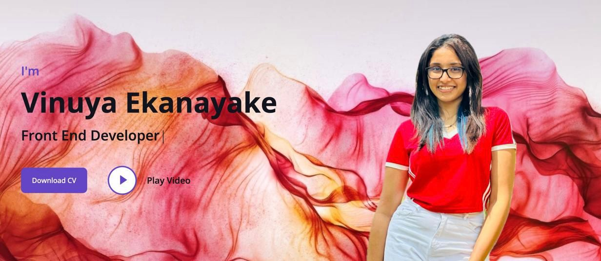

 <h1 align="center">Hi 👋,  I'm Vinuya Ekanayake</h1>

 
<h3 align="center">Enthusiastic web developer specializing in crafting intuitive and engaging user experiences, with a focus on leveraging AI to drive innovation and excellence.</h3> 

### 👤 More About Me:

- 🔭 &nbsp; I’m currently Studying in **SLIIT CITY UNI, Undergraduate** (university of Bedfordshire)
- 🌱 &nbsp; I’m currently learning **React.js/TypeScript and ML/Ai**
- 👨🏻‍💻 &nbsp; Most of my projects are available on [Github](https://github.com/VinuyaE?tab=repositories)
- 📩 &nbsp; How to reach me vinuyae2005@gmail.com
        
   

  
 

![Uploading <svg viewBox="-16 -32 880 192" width="880" height="192" xmlns="http://www.w3.org/2000/svg"><desc>Generated with https://github.com/Platane/snk</desc><rect class="c" x="2" y="2" rx="2" ry="2"/><rect class="c" x="2" y="18" rx="2" ry="2"/><rect class="c" x="2" y="34" rx="2" ry="2"/><rect class="c" x="2" y="50" rx="2" ry="2"/><rect class="c" x="2" y="66" rx="2" ry="2"/><rect class="c" x="2" y="82" rx="2" ry="2"/><rect class="c" x="2" y="98" rx="2" ry="2"/><rect class="c" x="18" y="2" rx="2" ry="2"/><rect class="c" x="18" y="18" rx="2" ry="2"/><rect class="c" x="18" y="34" rx="2" ry="2"/><rect class="c" x="18" y="50" rx="2" ry="2"/><rect class="c" x="18" y="66" rx="2" ry="2"/><rect class="c" x="18" y="82" rx="2" ry="2"/><rect class="c" x="18" y="98" rx="2" ry="2"/><rect class="c" x="34" y="2" rx="2" ry="2"/><rect class="c" x="34" y="18" rx="2" ry="2"/><rect class="c" x="34" y="34" rx="2" ry="2"/><rect class="c" x="34" y="50" rx="2" ry="2"/><rect class="c" x="34" y="66" rx="2" ry="2"/><rect class="c" x="34" y="82" rx="2" ry="2"/><rect class="c" x="34" y="98" rx="2" ry="2"/><rect class="c" x="50" y="2" rx="2" ry="2"/><rect class="c" x="50" y="18" rx="2" ry="2"/><rect class="c" x="50" y="34" rx="2" ry="2"/><rect class="c" x="50" y="50" rx="2" ry="2"/><rect class="c" x="50" y="66" rx="2" ry="2"/><rect class="c" x="50" y="82" rx="2" ry="2"/><rect class="c" x="50" y="98" rx="2" ry="2"/><rect class="c" x="66" y="2" rx="2" ry="2"/><rect class="c" x="66" y="18" rx="2" ry="2"/><rect class="c" x="66" y="34" rx="2" ry="2"/><rect class="c" x="66" y="50" rx="2" ry="2"/><rect class="c" x="66" y="66" rx="2" ry="2"/><rect class="c" x="66" y="82" rx="2" ry="2"/><rect class="c" x="66" y="98" rx="2" ry="2"/><rect class="c" x="82" y="2" rx="2" ry="2"/><rect class="c c0" x="82" y="18" rx="2" ry="2"/><rect class="c" x="82" y="34" rx="2" ry="2"/><rect class="c" x="82" y="50" rx="2" ry="2"/><rect class="c" x="82" y="66" rx="2" ry="2"/><rect class="c" x="82" y="82" rx="2" ry="2"/><rect class="c" x="82" y="98" rx="2" ry="2"/><rect class="c" x="98" y="2" rx="2" ry="2"/><rect class="c" x="98" y="18" rx="2" ry="2"/><rect class="c" x="98" y="34" rx="2" ry="2"/><rect class="c" x="98" y="50" rx="2" ry="2"/><rect class="c" x="98" y="66" rx="2" ry="2"/><rect class="c" x="98" y="82" rx="2" ry="2"/><rect class="c" x="98" y="98" rx="2" ry="2"/><rect class="c" x="114" y="2" rx="2" ry="2"/><rect class="c" x="114" y="18" rx="2" ry="2"/><rect class="c" x="114" y="34" rx="2" ry="2"/><rect class="c" x="114" y="50" rx="2" ry="2"/><rect class="c" x="114" y="66" rx="2" ry="2"/><rect class="c" x="114" y="82" rx="2" ry="2"/><rect class="c" x="114" y="98" rx="2" ry="2"/><rect class="c" x="130" y="2" rx="2" ry="2"/><rect class="c" x="130" y="18" rx="2" ry="2"/><rect class="c" x="130" y="34" rx="2" ry="2"/><rect class="c" x="130" y="50" rx="2" ry="2"/><rect class="c" x="130" y="66" rx="2" ry="2"/><rect class="c" x="130" y="82" rx="2" ry="2"/><rect class="c" x="130" y="98" rx="2" ry="2"/><rect class="c" x="146" y="2" rx="2" ry="2"/><rect class="c" x="146" y="18" rx="2" ry="2"/><rect class="c" x="146" y="34" rx="2" ry="2"/><rect class="c" x="146" y="50" rx="2" ry="2"/><rect class="c" x="146" y="66" rx="2" ry="2"/><rect class="c" x="146" y="82" rx="2" ry="2"/><rect class="c" x="146" y="98" rx="2" ry="2"/><rect class="c" x="162" y="2" rx="2" ry="2"/><rect class="c" x="162" y="18" rx="2" ry="2"/><rect class="c" x="162" y="34" rx="2" ry="2"/><rect class="c" x="162" y="50" rx="2" ry="2"/><rect class="c" x="162" y="66" rx="2" ry="2"/><rect class="c" x="162" y="82" rx="2" ry="2"/><rect class="c" x="162" y="98" rx="2" ry="2"/><rect class="c" x="178" y="2" rx="2" ry="2"/><rect class="c" x="178" y="18" rx="2" ry="2"/><rect class="c" x="178" y="34" rx="2" ry="2"/><rect class="c" x="178" y="50" rx="2" ry="2"/><rect class="c" x="178" y="66" rx="2" ry="2"/><rect class="c" x="178" y="82" rx="2" ry="2"/><rect class="c" x="178" y="98" rx="2" ry="2"/><rect class="c" x="194" y="2" rx="2" ry="2"/><rect class="c" x="194" y="18" rx="2" ry="2"/><rect class="c" x="194" y="34" rx="2" ry="2"/><rect class="c" x="194" y="50" rx="2" ry="2"/><rect class="c" x="194" y="66" rx="2" ry="2"/><rect class="c" x="194" y="82" rx="2" ry="2"/><rect class="c" x="194" y="98" rx="2" ry="2"/><rect class="c" x="210" y="2" rx="2" ry="2"/><rect class="c" x="210" y="18" rx="2" ry="2"/><rect class="c" x="210" y="34" rx="2" ry="2"/><rect class="c" x="210" y="50" rx="2" ry="2"/><rect class="c" x="210" y="66" rx="2" ry="2"/><rect class="c" x="210" y="82" rx="2" ry="2"/><rect class="c" x="210" y="98" rx="2" ry="2"/><rect class="c" x="226" y="2" rx="2" ry="2"/><rect class="c" x="226" y="18" rx="2" ry="2"/><rect class="c" x="226" y="34" rx="2" ry="2"/><rect class="c" x="226" y="50" rx="2" ry="2"/><rect class="c" x="226" y="66" rx="2" ry="2"/><rect class="c" x="226" y="82" rx="2" ry="2"/><rect class="c" x="226" y="98" rx="2" ry="2"/><rect class="c" x="242" y="2" rx="2" ry="2"/><rect class="c" x="242" y="18" rx="2" ry="2"/><rect class="c" x="242" y="34" rx="2" ry="2"/><rect class="c" x="242" y="50" rx="2" ry="2"/><rect class="c" x="242" y="66" rx="2" ry="2"/><rect class="c" x="242" y="82" rx="2" ry="2"/><rect class="c" x="242" y="98" rx="2" ry="2"/><rect class="c" x="258" y="2" rx="2" ry="2"/><rect class="c" x="258" y="18" rx="2" ry="2"/><rect class="c" x="258" y="34" rx="2" ry="2"/><rect class="c" x="258" y="50" rx="2" ry="2"/><rect class="c" x="258" y="66" rx="2" ry="2"/><rect class="c" x="258" y="82" rx="2" ry="2"/><rect class="c" x="258" y="98" rx="2" ry="2"/><rect class="c" x="274" y="2" rx="2" ry="2"/><rect class="c" x="274" y="18" rx="2" ry="2"/><rect class="c" x="274" y="34" rx="2" ry="2"/><rect class="c" x="274" y="50" rx="2" ry="2"/><rect class="c" x="274" y="66" rx="2" ry="2"/><rect class="c" x="274" y="82" rx="2" ry="2"/><rect class="c" x="274" y="98" rx="2" ry="2"/><rect class="c" x="290" y="2" rx="2" ry="2"/><rect class="c" x="290" y="18" rx="2" ry="2"/><rect class="c" x="290" y="34" rx="2" ry="2"/><rect class="c" x="290" y="50" rx="2" ry="2"/><rect class="c" x="290" y="66" rx="2" ry="2"/><rect class="c" x="290" y="82" rx="2" ry="2"/><rect class="c" x="290" y="98" rx="2" ry="2"/><rect class="c" x="306" y="2" rx="2" ry="2"/><rect class="c" x="306" y="18" rx="2" ry="2"/><rect class="c" x="306" y="34" rx="2" ry="2"/><rect class="c" x="306" y="50" rx="2" ry="2"/><rect class="c" x="306" y="66" rx="2" ry="2"/><rect class="c" x="306" y="82" rx="2" ry="2"/><rect class="c" x="306" y="98" rx="2" ry="2"/><rect class="c" x="322" y="2" rx="2" ry="2"/><rect class="c" x="322" y="18" rx="2" ry="2"/><rect class="c" x="322" y="34" rx="2" ry="2"/><rect class="c" x="322" y="50" rx="2" ry="2"/><rect class="c" x="322" y="66" rx="2" ry="2"/><rect class="c" x="322" y="82" rx="2" ry="2"/><rect class="c" x="322" y="98" rx="2" ry="2"/><rect class="c" x="338" y="2" rx="2" ry="2"/><rect class="c" x="338" y="18" rx="2" ry="2"/><rect class="c" x="338" y="34" rx="2" ry="2"/><rect class="c" x="338" y="50" rx="2" ry="2"/><rect class="c" x="338" y="66" rx="2" ry="2"/><rect class="c" x="338" y="82" rx="2" ry="2"/><rect class="c" x="338" y="98" rx="2" ry="2"/><rect class="c" x="354" y="2" rx="2" ry="2"/><rect class="c" x="354" y="18" rx="2" ry="2"/><rect class="c" x="354" y="34" rx="2" ry="2"/><rect class="c" x="354" y="50" rx="2" ry="2"/><rect class="c" x="354" y="66" rx="2" ry="2"/><rect class="c" x="354" y="82" rx="2" ry="2"/><rect class="c" x="354" y="98" rx="2" ry="2"/><rect class="c" x="370" y="2" rx="2" ry="2"/><rect class="c" x="370" y="18" rx="2" ry="2"/><rect class="c" x="370" y="34" rx="2" ry="2"/><rect class="c" x="370" y="50" rx="2" ry="2"/><rect class="c" x="370" y="66" rx="2" ry="2"/><rect class="c" x="370" y="82" rx="2" ry="2"/><rect class="c" x="370" y="98" rx="2" ry="2"/><rect class="c" x="386" y="2" rx="2" ry="2"/><rect class="c" x="386" y="18" rx="2" ry="2"/><rect class="c" x="386" y="34" rx="2" ry="2"/><rect class="c" x="386" y="50" rx="2" ry="2"/><rect class="c" x="386" y="66" rx="2" ry="2"/><rect class="c" x="386" y="82" rx="2" ry="2"/><rect class="c" x="386" y="98" rx="2" ry="2"/><rect class="c" x="402" y="2" rx="2" ry="2"/><rect class="c" x="402" y="18" rx="2" ry="2"/><rect class="c" x="402" y="34" rx="2" ry="2"/><rect class="c" x="402" y="50" rx="2" ry="2"/><rect class="c" x="402" y="66" rx="2" ry="2"/><rect class="c" x="402" y="82" rx="2" ry="2"/><rect class="c" x="402" y="98" rx="2" ry="2"/><rect class="c" x="418" y="2" rx="2" ry="2"/><rect class="c" x="418" y="18" rx="2" ry="2"/><rect class="c" x="418" y="34" rx="2" ry="2"/><rect class="c" x="418" y="50" rx="2" ry="2"/><rect class="c" x="418" y="66" rx="2" ry="2"/><rect class="c" x="418" y="82" rx="2" ry="2"/><rect class="c" x="418" y="98" rx="2" ry="2"/><rect class="c" x="434" y="2" rx="2" ry="2"/><rect class="c" x="434" y="18" rx="2" ry="2"/><rect class="c" x="434" y="34" rx="2" ry="2"/><rect class="c" x="434" y="50" rx="2" ry="2"/><rect class="c" x="434" y="66" rx="2" ry="2"/><rect class="c" x="434" y="82" rx="2" ry="2"/><rect class="c" x="434" y="98" rx="2" ry="2"/><rect class="c" x="450" y="2" rx="2" ry="2"/><rect class="c" x="450" y="18" rx="2" ry="2"/><rect class="c" x="450" y="34" rx="2" ry="2"/><rect class="c" x="450" y="50" rx="2" ry="2"/><rect class="c" x="450" y="66" rx="2" ry="2"/><rect class="c" x="450" y="82" rx="2" ry="2"/><rect class="c" x="450" y="98" rx="2" ry="2"/><rect class="c" x="466" y="2" rx="2" ry="2"/><rect class="c" x="466" y="18" rx="2" ry="2"/><rect class="c" x="466" y="34" rx="2" ry="2"/><rect class="c" x="466" y="50" rx="2" ry="2"/><rect class="c" x="466" y="66" rx="2" ry="2"/><rect class="c" x="466" y="82" rx="2" ry="2"/><rect class="c" x="466" y="98" rx="2" ry="2"/><rect class="c" x="482" y="2" rx="2" ry="2"/><rect class="c" x="482" y="18" rx="2" ry="2"/><rect class="c" x="482" y="34" rx="2" ry="2"/><rect class="c" x="482" y="50" rx="2" ry="2"/><rect class="c" x="482" y="66" rx="2" ry="2"/><rect class="c" x="482" y="82" rx="2" ry="2"/><rect class="c" x="482" y="98" rx="2" ry="2"/><rect class="c" x="498" y="2" rx="2" ry="2"/><rect class="c" x="498" y="18" rx="2" ry="2"/><rect class="c" x="498" y="34" rx="2" ry="2"/><rect class="c" x="498" y="50" rx="2" ry="2"/><rect class="c" x="498" y="66" rx="2" ry="2"/><rect class="c" x="498" y="82" rx="2" ry="2"/><rect class="c" x="498" y="98" rx="2" ry="2"/><rect class="c" x="514" y="2" rx="2" ry="2"/><rect class="c" x="514" y="18" rx="2" ry="2"/><rect class="c" x="514" y="34" rx="2" ry="2"/><rect class="c" x="514" y="50" rx="2" ry="2"/><rect class="c" x="514" y="66" rx="2" ry="2"/><rect class="c" x="514" y="82" rx="2" ry="2"/><rect class="c" x="514" y="98" rx="2" ry="2"/><rect class="c" x="530" y="2" rx="2" ry="2"/><rect class="c" x="530" y="18" rx="2" ry="2"/><rect class="c" x="530" y="34" rx="2" ry="2"/><rect class="c" x="530" y="50" rx="2" ry="2"/><rect class="c" x="530" y="66" rx="2" ry="2"/><rect class="c" x="530" y="82" rx="2" ry="2"/><rect class="c" x="530" y="98" rx="2" ry="2"/><rect class="c" x="546" y="2" rx="2" ry="2"/><rect class="c" x="546" y="18" rx="2" ry="2"/><rect class="c" x="546" y="34" rx="2" ry="2"/><rect class="c" x="546" y="50" rx="2" ry="2"/><rect class="c" x="546" y="66" rx="2" ry="2"/><rect class="c" x="546" y="82" rx="2" ry="2"/><rect class="c" x="546" y="98" rx="2" ry="2"/><rect class="c" x="562" y="2" rx="2" ry="2"/><rect class="c" x="562" y="18" rx="2" ry="2"/><rect class="c" x="562" y="34" rx="2" ry="2"/><rect class="c" x="562" y="50" rx="2" ry="2"/><rect class="c" x="562" y="66" rx="2" ry="2"/><rect class="c" x="562" y="82" rx="2" ry="2"/><rect class="c" x="562" y="98" rx="2" ry="2"/><rect class="c" x="578" y="2" rx="2" ry="2"/><rect class="c" x="578" y="18" rx="2" ry="2"/><rect class="c" x="578" y="34" rx="2" ry="2"/><rect class="c" x="578" y="50" rx="2" ry="2"/><rect class="c" x="578" y="66" rx="2" ry="2"/><rect class="c" x="578" y="82" rx="2" ry="2"/><rect class="c" x="578" y="98" rx="2" ry="2"/><rect class="c" x="594" y="2" rx="2" ry="2"/><rect class="c" x="594" y="18" rx="2" ry="2"/><rect class="c" x="594" y="34" rx="2" ry="2"/><rect class="c" x="594" y="50" rx="2" ry="2"/><rect class="c" x="594" y="66" rx="2" ry="2"/><rect class="c" x="594" y="82" rx="2" ry="2"/><rect class="c" x="594" y="98" rx="2" ry="2"/><rect class="c" x="610" y="2" rx="2" ry="2"/><rect class="c" x="610" y="18" rx="2" ry="2"/><rect class="c" x="610" y="34" rx="2" ry="2"/><rect class="c" x="610" y="50" rx="2" ry="2"/><rect class="c" x="610" y="66" rx="2" ry="2"/><rect class="c" x="610" y="82" rx="2" ry="2"/><rect class="c" x="610" y="98" rx="2" ry="2"/><rect class="c" x="626" y="2" rx="2" ry="2"/><rect class="c" x="626" y="18" rx="2" ry="2"/><rect class="c" x="626" y="34" rx="2" ry="2"/><rect class="c" x="626" y="50" rx="2" ry="2"/><rect class="c" x="626" y="66" rx="2" ry="2"/><rect class="c" x="626" y="82" rx="2" ry="2"/><rect class="c" x="626" y="98" rx="2" ry="2"/><rect class="c" x="642" y="2" rx="2" ry="2"/><rect class="c" x="642" y="18" rx="2" ry="2"/><rect class="c" x="642" y="34" rx="2" ry="2"/><rect class="c" x="642" y="50" rx="2" ry="2"/><rect class="c" x="642" y="66" rx="2" ry="2"/><rect class="c" x="642" y="82" rx="2" ry="2"/><rect class="c" x="642" y="98" rx="2" ry="2"/><rect class="c" x="658" y="2" rx="2" ry="2"/><rect class="c" x="658" y="18" rx="2" ry="2"/><rect class="c" x="658" y="34" rx="2" ry="2"/><rect class="c" x="658" y="50" rx="2" ry="2"/><rect class="c" x="658" y="66" rx="2" ry="2"/><rect class="c" x="658" y="82" rx="2" ry="2"/><rect class="c" x="658" y="98" rx="2" ry="2"/><rect class="c" x="674" y="2" rx="2" ry="2"/><rect class="c" x="674" y="18" rx="2" ry="2"/><rect class="c" x="674" y="34" rx="2" ry="2"/><rect class="c" x="674" y="50" rx="2" ry="2"/><rect class="c" x="674" y="66" rx="2" ry="2"/><rect class="c" x="674" y="82" rx="2" ry="2"/><rect class="c" x="674" y="98" rx="2" ry="2"/><rect class="c" x="690" y="2" rx="2" ry="2"/><rect class="c" x="690" y="18" rx="2" ry="2"/><rect class="c" x="690" y="34" rx="2" ry="2"/><rect class="c" x="690" y="50" rx="2" ry="2"/><rect class="c" x="690" y="66" rx="2" ry="2"/><rect class="c" x="690" y="82" rx="2" ry="2"/><rect class="c" x="690" y="98" rx="2" ry="2"/><rect class="c" x="706" y="2" rx="2" ry="2"/><rect class="c" x="706" y="18" rx="2" ry="2"/><rect class="c" x="706" y="34" rx="2" ry="2"/><rect class="c" x="706" y="50" rx="2" ry="2"/><rect class="c" x="706" y="66" rx="2" ry="2"/><rect class="c" x="706" y="82" rx="2" ry="2"/><rect class="c" x="706" y="98" rx="2" ry="2"/><rect class="c" x="722" y="2" rx="2" ry="2"/><rect class="c" x="722" y="18" rx="2" ry="2"/><rect class="c" x="722" y="34" rx="2" ry="2"/><rect class="c" x="722" y="50" rx="2" ry="2"/><rect class="c" x="722" y="66" rx="2" ry="2"/><rect class="c" x="722" y="82" rx="2" ry="2"/><rect class="c" x="722" y="98" rx="2" ry="2"/><rect class="c" x="738" y="2" rx="2" ry="2"/><rect class="c" x="738" y="18" rx="2" ry="2"/><rect class="c" x="738" y="34" rx="2" ry="2"/><rect class="c" x="738" y="50" rx="2" ry="2"/><rect class="c" x="738" y="66" rx="2" ry="2"/><rect class="c" x="738" y="82" rx="2" ry="2"/><rect class="c" x="738" y="98" rx="2" ry="2"/><rect class="c" x="754" y="2" rx="2" ry="2"/><rect class="c" x="754" y="18" rx="2" ry="2"/><rect class="c" x="754" y="34" rx="2" ry="2"/><rect class="c" x="754" y="50" rx="2" ry="2"/><rect class="c" x="754" y="66" rx="2" ry="2"/><rect class="c" x="754" y="82" rx="2" ry="2"/><rect class="c" x="754" y="98" rx="2" ry="2"/><rect class="c" x="770" y="2" rx="2" ry="2"/><rect class="c" x="770" y="18" rx="2" ry="2"/><rect class="c" x="770" y="34" rx="2" ry="2"/><rect class="c" x="770" y="50" rx="2" ry="2"/><rect class="c" x="770" y="66" rx="2" ry="2"/><rect class="c" x="770" y="82" rx="2" ry="2"/><rect class="c" x="770" y="98" rx="2" ry="2"/><rect class="c" x="786" y="2" rx="2" ry="2"/><rect class="c" x="786" y="18" rx="2" ry="2"/><rect class="c" x="786" y="34" rx="2" ry="2"/><rect class="c" x="786" y="50" rx="2" ry="2"/><rect class="c" x="786" y="66" rx="2" ry="2"/><rect class="c" x="786" y="82" rx="2" ry="2"/><rect class="c" x="786" y="98" rx="2" ry="2"/><rect class="c" x="802" y="2" rx="2" ry="2"/><rect class="c" x="802" y="18" rx="2" ry="2"/><rect class="c" x="802" y="34" rx="2" ry="2"/><rect class="c" x="802" y="50" rx="2" ry="2"/><rect class="c" x="802" y="66" rx="2" ry="2"/><rect class="c" x="802" y="82" rx="2" ry="2"/><rect class="c" x="802" y="98" rx="2" ry="2"/><rect class="c" x="818" y="2" rx="2" ry="2"/><rect class="c" x="818" y="18" rx="2" ry="2"/><rect class="c" x="818" y="34" rx="2" ry="2"/><rect class="c" x="818" y="50" rx="2" ry="2"/><rect class="c" x="818" y="66" rx="2" ry="2"/><rect class="c" x="818" y="82" rx="2" ry="2"/><rect class="c" x="818" y="98" rx="2" ry="2"/><rect class="c c1" x="834" y="2" rx="2" ry="2"/><rect class="c c2" x="834" y="18" rx="2" ry="2"/><rect class="c" x="834" y="34" rx="2" ry="2"/><rect class="c c3" x="834" y="50" rx="2" ry="2"/><rect class="c" x="834" y="66" rx="2" ry="2"/><rect class="u u0" height="12" width="424.6" x="0.0" y="144"/><rect class="u u1" height="12" width="424.6" x="424.0" y="144"/><rect class="s s0" x="0.8" y="0.8" width="14.4" height="14.4" rx="4.5" ry="4.5"/><rect class="s s1" x="1.8" y="1.8" width="12.3" height="12.3" rx="4.1" ry="4.1"/><rect class="s s2" x="2.6" y="2.6" width="10.8" height="10.8" rx="3.6" ry="3.6"/><rect class="s s3" x="3.0" y="3.0" width="9.9" height="9.9" rx="3.3" ry="3.3"/></svg>github-user-contribution (1).svg…]()

<h2 align="center">Technology Stack </h2>

  

<h2 align="center">Reach me out on </h2>

 

<h2 align="center">
  My Github Stats
</h2>
 
 

  
  

 

 

